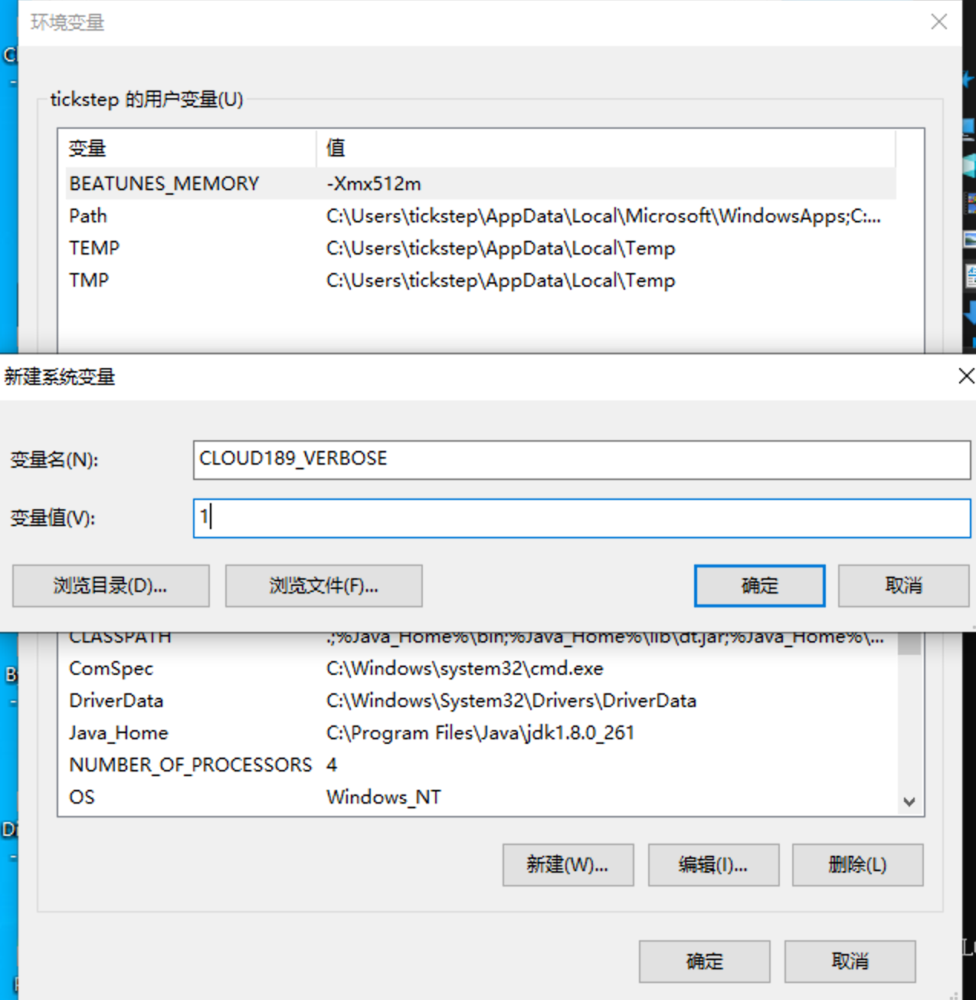
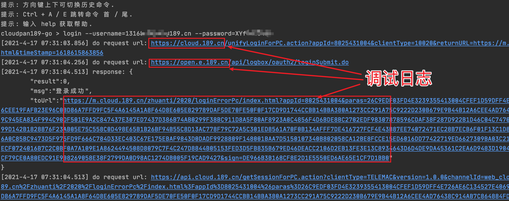

# 关于
天翼云盘CLI，基于GO语言实现。仿 Linux shell 文件处理命令的天翼云盘命令行客户端。

# 注意事项
*本项目还处于开发阶段，未经过充分的测试，如有bug欢迎提交issue.*   

# 版本标签说明
1. arm / armv5 / armv7 : 适用32位ARM系统
2. arm64 : 适用64位ARM系统
3. 386 / x86 : 适用32系统，包括Intel和AMD的CPU系统
4. amd64 / x64 : 适用64位系统，包括Intel和AMD的CPU系统
5. mips : 适用MIPS指令集的CPU，例如国产龙芯CPU
6. macOS amd64适用Intel CPU的机器，macOS arm64目前主要是适用苹果M1芯片的机器
7. iOS arm64适用iPhone手机，并且必须是越狱的手机才能正常运行

# 目录
- [特色](#特色)
- [下载/运行 说明](#下载运行说明)
  * [Windows](#windows)
  * [Linux / macOS](#linux--macos)
- [命令列表及说明](#命令列表及说明)
  * [注意](#注意)
  * [检测程序更新](#检测程序更新)
  * [查看帮助](#查看帮助)
  * [登录天翼云盘帐号](#登录天翼云盘帐号)
  * [列出帐号列表](#列出帐号列表)
  * [获取当前帐号](#获取当前帐号)
  * [切换天翼云盘帐号](#切换天翼云盘帐号)
  * [退出天翼云盘帐号](#退出天翼云盘帐号)
  * [切换云工作模式(个人云/家庭云)](#切换云工作模式)
  * [签到](#签到)
  * [获取网盘配额](#获取网盘配额)
  * [切换工作目录](#切换工作目录)
  * [输出工作目录](#输出工作目录)
  * [列出目录](#列出目录)
  * [下载文件/目录](#下载文件目录)
  * [上传文件/目录](#上传文件目录)
  * [备份文件/目录](#备份文件目录)  
  * [手动秒传文件](#手动秒传文件)
  * [创建目录](#创建目录)
  * [删除文件/目录](#删除文件目录)
  * [拷贝文件/目录](#拷贝文件目录)
  * [转存拷贝文件/目录](#转存拷贝文件目录)  
  * [移动文件/目录](#移动文件目录)
  * [重命名文件/目录](#重命名文件目录)
  * [导出文件](#导出文件)
  * [导入文件](#导入文件)
  * [分享文件/目录](#分享文件目录)
    + [设置分享文件/目录](#设置分享文件目录)
    + [列出已分享文件/目录](#列出已分享文件目录)
    + [取消分享文件/目录](#取消分享文件目录)
    + [转存分享](#转存分享)
  * [显示和修改程序配置项](#显示和修改程序配置项)
- [常见问题Q&A](#常见问题Q&A)  
  * [1. 如何开启Debug调试日志](#1-如何开启Debug调试日志)
- [交流反馈](#交流反馈)
- [鸣谢](#鸣谢)


# 特色
1. 多平台支持, 支持 Windows, macOS, linux, android, iOS等
2. 天翼云盘多用户支持
3. 支持个人云，家庭云无缝切换
4. 支持导入/导出功能，快速备份（导出）和恢复（导入）网盘文件。利用该功能可以进行跨网盘迁移文件
5. [下载](#下载文件目录)网盘内文件, 支持多个文件或目录下载, 支持断点续传和单文件并行下载
6. [上传](#上传文件目录)本地文件, 支持多个文件或目录上传


# 下载/运行说明

可以直接在[发布页](https://github.com/tickstep/cloudpan189-go/releases)下载使用.

也可以使用这个天翼云盘分享链接进行下载：[天翼云盘下载链接](https://cloud.189.cn/t/RzUNre7nq2Uf)（访问码：io7x）

如果程序运行时输出乱码, 请检查下终端的编码方式是否为 `UTF-8`.

使用本程序之前, 非常建议先学习一些 linux 基础命令知识.

如果没有带任何参数运行程序, 程序将会进入仿Linux shell系统用户界面的cli交互模式, 可直接运行相关命令.

cli交互模式下, 光标所在行的前缀应为 `cloudpan189-go >`, 如果登录了帐号则格式为 `cloudpan189-go:<工作目录> <用户ID>$ `

程序会提供相关命令的使用说明.

## Windows

程序应在 命令提示符 (Command Prompt) 或 PowerShell 中运行.

也可直接双击程序运行, 具体使用方法请参见 [命令列表及说明](#命令列表及说明) 和 [初级使用教程](#初级使用教程).

## Linux / macOS

程序应在 终端 (Terminal) 运行.

具体使用方法请参见 [命令列表及说明](#命令列表及说明) .


# 命令列表及说明

## 注意

命令的前缀 `cloudpan189-go` 为指向程序运行的全路径名 (ARGv 的第一个参数)

直接运行程序时, 未带任何其他参数, 则程序进入cli交互模式, 进入cli模式运行以下命令时要把命令的前缀 `cloudpan189-go` 去掉! 即不需要输入`cloudpan189-go`。

cli交互模式已支持按tab键自动补全命令.

## 检测程序更新
```
cloudpan189-go update
```

## 查看帮助
```
cloudpan189-go help
```
### 例子
```
列出程序支持的命令
cloudpan189-go help

查看login命令的帮助手册
cloudpan189-go help login
```

## 登录天翼云盘帐号

### 登录

```
cloudpan189-go login
```

### 例子
```
按照引导步骤登录
cloudpan189-go login
请输入用户名(手机号/邮箱/别名), 回车键提交 > 1234567

命令行指定用户名和密码登录
cloudpan189-go login -username=tickstep -password=123xxx
```


## 列出帐号列表

```
cloudpan189-go loglist
```

列出所有已登录的帐号

## 获取当前帐号

```
cloudpan189-go who
```

## 切换天翼云盘帐号

切换已登录的帐号
```
cloudpan189-go su <uid>
```
```
cloudpan189-go su

请输入要切换帐号的 # 值 >
```

## 退出天翼云盘帐号

退出当前登录的帐号
```
cloudpan189-go logout
```

程序会进一步确认退出帐号, 防止误操作.

## 切换云工作模式
程序默认工作在个人云盘下，如需切换到家庭云，可以使用本命令进行切换。
切换已登录的天翼帐号的家庭云和个人云。0为个人云
```
cloudpan189-go family <familyId>
```
```
cloudpan189-go family

输入要切换的家庭云 # 值 >
```

## 签到

进行一键签到并抽奖
```
cloudpan189-go sign
```

## 获取网盘配额

```
cloudpan189-go quota
```
获取网盘的总储存空间, 和已使用的储存空间

## 切换工作目录
```
cloudpan189-go cd <目录>
```

### 例子
```
# 切换 /我的文档 工作目录
cloudpan189-go cd /我的文档

# 切换 上级目录
cloudpan189-go cd ..

# 切换 根目录
cloudpan189-go cd /

```

## 输出工作目录
```
cloudpan189-go pwd
```

## 列出目录

列出当前工作目录的文件和目录或指定目录
```
cloudpan189-go ls
```
```
cloudpan189-go ls <目录>
```

### 可选参数
```
-asc: 升序排序
-desc: 降序排序
-time: 根据时间排序
-name: 根据文件名排序
-size: 根据大小排序
```

### 例子
```
# 列出 我的文档 内的文件和目录
cloudpan189-go ls 我的文档

# 绝对路径
cloudpan189-go ls /我的文档

# 降序排序
cloudpan189-go ls -desc 我的文档

# 按文件大小降序排序
cloudpan189-go ls -size -desc 我的文档
```

## 下载文件/目录
```
cloudpan189-go download <网盘文件或目录的路径1> <文件或目录2> <文件或目录3> ...
cloudpan189-go d <网盘文件或目录的路径1> <文件或目录2> <文件或目录3> ...
```

### 可选参数
```
  --ow            overwrite, 覆盖已存在的文件
  --status        输出所有线程的工作状态
  --save          将下载的文件直接保存到当前工作目录
  --saveto value  将下载的文件直接保存到指定的目录
  -x              为文件加上执行权限, (windows系统无效)
  -p value        指定下载线程数 (default: 0)
  -l value        指定同时进行下载文件的数量 (default: 0)
  --retry value   下载失败最大重试次数 (default: 3)
  --nocheck       下载文件完成后不校验文件
  --exn value     指定排除的文件夹或者文件的名称，只支持正则表达式。支持排除多个名称，每一个名称就是一个exn参数
```


### 例子
```
# 设置保存目录, 保存到 D:\Downloads
# 注意区别反斜杠 "\" 和 斜杠 "/" !!!
cloudpan189-go config set -savedir D:/Downloads

# 下载 /我的文档/1.mp4
cloudpan189-go d /我的文档/1.mp4

# 下载 /我的文档 整个目录!!
cloudpan189-go d /我的文档
```

下载的文件默认保存到 **程序所在目录** 的 download/ 目录, 支持设置指定目录, 重名的文件会自动跳过!

通过 `cloudpan189-go config set -savedir <savedir>` 可以自定义保存的目录.

支持多个文件或目录下载.

自动跳过下载重名的文件!

## 上传文件/目录
```
cloudpan189-go upload <本地文件/目录的路径1> <文件/目录2> <文件/目录3> ... <目标目录>
cloudpan189-go u <本地文件/目录的路径1> <文件/目录2> <文件/目录3> ... <目标目录>
```

### 例子:
```
# 将本地的 C:\Users\Administrator\Desktop\1.mp4 上传到网盘 /视频 目录
# 注意区别反斜杠 "\" 和 斜杠 "/" !!!
cloudpan189-go upload C:/Users/Administrator/Desktop/1.mp4 /视频

# 将本地的 C:\Users\Administrator\Desktop\1.mp4 和 C:\Users\Administrator\Desktop\2.mp4 上传到网盘 /视频 目录
cloudpan189-go upload C:/Users/Administrator/Desktop/1.mp4 C:/Users/Administrator/Desktop/2.mp4 /视频

# 将本地的 C:\Users\Administrator\Desktop 整个目录上传到网盘 /视频 目录
cloudpan189-go upload C:/Users/Administrator/Desktop /视频

## 下面演示文件或者文件夹排除功能

# 将本地的 C:\Users\Administrator\Video 整个目录上传到网盘 /视频 目录，但是排除所有的.jpg文件
cloudpan189-go upload -exn "\.jpg$" C:/Users/Administrator/Video /视频

# 将本地的 C:\Users\Administrator\Video 整个目录上传到网盘 /视频 目录，但是排除所有的.jpg文件和.mp3文件，每一个排除项就是一个exn参数
cloudpan189-go upload -exn "\.jpg$" -exn "\.mp3$" C:/Users/Administrator/Video /视频

以下是典型的排除特定文件或者文件夹的例子，注意：参数值必须是正则表达式
排除@eadir文件或者文件夹：-exn "^@eadir$"
排除.jpg文件：-exn "\.jpg$"
排除.号开头的文件：-exn "^\."
排除 myfile.txt 文件：-exn "^myfile.txt$"
```

## 备份文件/目录

备份功能一般用于NAS等系统，日常只进行增量备份操作，默认情况下本地删除不影响网盘文件。

比如在手机上备分照片目录，就可以使用这个功能定时备份，备份完成后本地文件可安全删除。

基本用法和`upload`命令一样，额外增加两个参数

>1. delete 用于同步删除操作（只通过本地数据库记录对比）。 
>2. sync 使网盘上的文件和本地文件同步（本地为主），会删除网盘中不存在于本地的文件或目录（速度比较慢）。  
>sync 和 delete 的区别在于sync是通过网盘文件列表和本地文件进行判断。  
>delete 只通过本地数据库进行判断,正常情况下使用 delete 就够用了。
 
和 `upload` 相比由于增加了本地数据库，可以快速判断文件是否有更新等，大大减少了 API 的调用，操作速度更快。

```
cloudpan189-go backup <本地目录1> <目录2> <目录3> ... <目标目录>
注：
1. 默认使用 sqlite 数据库，可以通过 config 命令切换。
2. 默认不删除网盘文件，可用 delete 或 sync 参数进行同步删除。
```

### 例子:
```
# 将本地的 C:\Users\Administrator\Desktop 备份到网盘 /test 目录
# 注意区别反斜杠 "\" 和 斜杠 "/" !!!
cloudpan189-go backup C:/Users/Administrator/Desktop /test
```

## 手动秒传上传文件
```
cloudpan189-go rapidupload -size=<文件的大小> -md5=<文件的md5值> <保存的网盘路径, 需包含文件名>
```

### 例子:
```
如果秒传成功, 则保存到网盘路径 /test/file.txt
cloudpan189-go rapidupload -size=56276137 -md5=fbe082d80e90f90f0fb1f94adbbcfa7f /test/file.txt
```

## 创建目录
```
cloudpan189-go mkdir <目录>
```

### 例子
```
cloudpan189-go mkdir test123
```

## 删除文件/目录
```
cloudpan189-go rm <网盘文件或目录的路径1> <文件或目录2> <文件或目录3> ...
```

注意: 删除多个文件和目录时, 请确保每一个文件和目录都存在, 否则删除操作会失败.

被删除的文件或目录可在网盘文件回收站找回.

### 例子
```
# 删除 /我的文档/1.mp4
cloudpan189-go rm /我的文档/1.mp4

# 删除 /我的文档/1.mp4 和 /我的文档/2.mp4
cloudpan189-go rm /我的文档/1.mp4 /我的文档/2.mp4

# 删除 /我的文档 整个目录 !!
cloudpan189-go rm /我的文档
```


## 拷贝文件/目录
```
cloudpan189-go cp <文件/目录> <目标 文件/目录>
cloudpan189-go cp <文件/目录1> <文件/目录2> <文件/目录3> ... <目标目录>
```

注意: 拷贝多个文件和目录时, 请确保每一个文件和目录都存在, 否则拷贝操作会失败.

### 例子
```
# 将 /我的文档/1.mp4 复制到 根目录 /
cloudpan189-go cp /我的文档/1.mp4 /

# 将 /我的文档/1.mp4 和 /我的文档/2.mp4 复制到 根目录 /
cloudpan189-go cp /我的文档/1.mp4 /我的文档/2.mp4 /
```

## 转存拷贝文件/目录
转存拷贝，即在家庭云和个人云之间拷贝文件
```
cloudpan189-go xcp <文件/目录>
cloudpan189-go xcp <文件/目录1> <文件/目录2> <文件/目录3>
```

注意: 拷贝多个文件和目录时, 请确保每一个文件和目录都存在, 否则拷贝操作会失败. 同样需要保证目标云不存在对应的文件，否则也会操作失败。

### 例子
```
当前工作在个人云模式下，将 /个人云目录/1.mp4 复制到 家庭云根目录中
cloudpan189-go xcp /个人云目录/1.mp4

当前工作在家庭云模式下，将 /家庭云目录/1.mp4 和 /家庭云目录/2.mp4 复制到 个人云 /来自家庭共享 目录中
cloudpan189-go xcp /家庭云目录/1.mp4 /家庭云目录/2.mp4
```


## 移动文件/目录
```
cloudpan189-go mv <文件/目录1> <文件/目录2> <文件/目录3> ... <目标目录>
```

注意: 移动多个文件和目录时, 请确保每一个文件和目录都存在, 否则移动操作会失败.

### 例子
```
# 将 /我的文档/1.mp4 移动到 根目录 /
cloudpan189-go mv /我的文档/1.mp4 /
```

## 重命名文件/目录
```
cloudpan189-go rename <旧文件/目录名> <新文件/目录名>
```

注意: 重命名的文件/目录，如果指定的是绝对路径，则必须保证新旧的绝对路径在同一个文件夹内，否则重命名失败！

### 例子
```
# 将 /我的文档/1.mp4 重命名为 /我的文档/2.mp4
cloudpan189-go rename /我的文档/1.mp4 /我的文档/2.mp4
```

## 导出文件
```
cloudpan189-go export <网盘文件/目录的路径1> <文件/目录2> <文件/目录3> ... <本地保存文件路径>
```
导出指定文件/目录下面的所有文件的元数据信息，并保存到指定的本地文件里面。导出的文件元信息可以使用 import 命令（秒传文件功能）导入到网盘中。

### 例子
```
导出 /我的资源 整个目录 元数据到文件 /Users/tickstep/Downloads/export_files.txt
cloudpan189-go export /我的资源 /Users/tickstep/Downloads/export_files.txt

导出 网盘 整个目录 元数据到文件 /Users/tickstep/Downloads/export_files.txt
cloudpan189-go export / /Users/tickstep/Downloads/export_files.txt
```

## 导入文件
```
cloudpan189-go export <本地元数据文件路径>
```
导入文件中记录的元数据文件到网盘。保存到网盘的文件会使用文件元数据记录的路径位置，如果没有指定云盘目录(saveto)则默认导入到目录 cloudpan189-go 中。
导入的文件可以使用 export 命令获得。
    
导入文件每一行是一个文件元数据，样例如下：
```
{"md5":"3F9EEEBC4E583574D9D64A75E5061E56","size":6365224,"path":"/test/file.dmg"}
```
  
### 例子
```
导入文件 /Users/tickstep/Downloads/export_files.txt
cloudpan189-go import /Users/tickstep/Downloads/export_files.txt

导入文件 /Users/tickstep/Downloads/export_files.txt 并保存到目录 /my2020 中
cloudpan189-go import -saveto=/my2020 /Users/tickstep/Downloads/export_files.txt

导入文件 /Users/tickstep/Downloads/export_files.txt 并保存到网盘根目录 / 中
cloudpan189-go import -saveto=/ /Users/tickstep/Downloads/export_files.txt
```

## 分享文件/目录
```
cloudpan189-go share
```

### 设置分享文件/目录
```
cloudpan189-go share set <文件/目录1> <文件/目录2> ...
cloudpan189-go share s <文件/目录1> <文件/目录2> ...
```

### 列出已分享文件/目录
```
cloudpan189-go share list
cloudpan189-go share l
```

### 取消分享文件/目录
```
cloudpan189-go share cancel <shareid_1> <shareid_2> ...
cloudpan189-go share c <shareid_1> <shareid_2> ...
```
目前只支持通过分享id (shareid) 来取消分享.


### 转存分享
```
cloudpan189-go share save [save_dir_path] [share_url]

例子
将 https://cloud.189.cn/t/RzUNre7nq2Uf 分享链接里面的全部文件转存到 /我的文档 这个网盘目录里面
cloudpan189-go share save /我的文档 https://cloud.189.cn/t/RzUNre7nq2Uf（访问码：io7x）
```
注意：转存需要一定的时间才能生效，需要等待一会才能完全转存到网盘文件夹里面


## 显示和修改程序配置项
```
# 显示配置
cloudpan189-go config

# 设置配置
cloudpan189-go config set
```


### 例子
```
# 显示所有可以设置的值
cloudpan189-go config -h
cloudpan189-go config set -h

# 设置下载文件的储存目录
cloudpan189-go config set -savedir D:/Downloads

# 设置下载最大并发量为 15
cloudpan189-go config set -max_download_parallel 15

# 组合设置
cloudpan189-go config set -max_download_parallel 15 -savedir D:/Downloads
```

# 常见问题Q&A

## 1 如何开启Debug调试日志
当需要定位问题，或者提交issue的时候抓取log，则需要开启debug日志。步骤如下：

### 第一步
Linux&MacOS   
命令行运行
```
export CLOUD189_VERBOSE=1
```

Windows   
不同版本会有些许不一样，请自行查询具体方法   
设置示意图如下：


### 第二步
打开cloudpan189-go命令行程序，任何云盘命令都有类似如下日志输出



# 交流反馈

提交issue: [issues页面](https://github.com/tickstep/cloudpan189-go/issues)   
联系邮箱: tickstep@outlook.com

# 鸣谢
本项目大量借鉴了以下相关项目的功能&成果   
> [iikira/BaiduPCS-Go](https://github.com/iikira/BaiduPCS-Go)   
> [Aruelius/cloud189](https://github.com/Aruelius/cloud189)   
